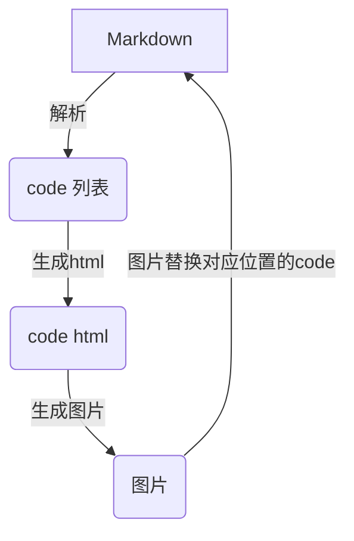

> Given an array nums and a target value k, find the maximum length of a subarray that sums to k. If there isn't one, return 0 instead.

**Example 1:**

Given nums = [1, -1, 5, -2, 3], k = 3,
return 4. (because the subarray [1, -1, 5, -2] sums to 3 and is the longest)

**Example 2:**

Given nums = [-2, -1, 2, 1], k = 1,
return 2. (because the subarray [-1, 2] sums to 1 and is the longest)

Follow Up:
Can you do it in O(n) time?

这个题目如果用简单的方法（暴力穷举）来处理的话比较简单，但是时间复杂度是O(n^2)。也可以使用hash来解。

先看第一个例子

数组为：[1, -1, 5, -2, 3]       目标值为：k = 3
字串是连续的，所以这里我们先分别计算出前n个元素的和，结果存入hash。
这个数组得到的结果是：

sum dict {0: -1, 1: 0, 0: 1, 5: 2, 3: 3, 6: 4}。

使用 sum - k 得到的值如果在 sum dict 中，说明在sum dict 中的元素所在位置到当前位置的这个子串就是我们想要的结果。因为这里求的是最长子串，所以，sum dict 中后出现的index 可以忽略。

我们用 sum - k 得到的结果为：

[-2, -3, 2, 0, 3]

发现 0 存在在sum dict 中，index 是0，所以，0 到 3 的和为k。


golang 版解答

```go
package main

import "fmt"

func max(a, b int) int {
	if a >= b {
		return a
	} else {
		return b
	}
}

func maxSubArrayLen(nums []int, k int) int {
	result, sum := 0, 0
	dict := map[int]int{0: -1}

	for i := 0; i < len(nums); i++ {
		sum += nums[i]
		_, ok := dict[sum]
		if !ok {
			dict[sum] = i
		}
		if _, ok := dict[sum-k]; ok {
			result = max(result, i-dict[sum-k])
		}
	}
	return result
}

func main() {
	fmt.Println(maxSubArrayLen([]int{1, 2, 3, 4}, 10))
	fmt.Println(maxSubArrayLen([]int{1, -2, -3, 4}, -1))
}
```



